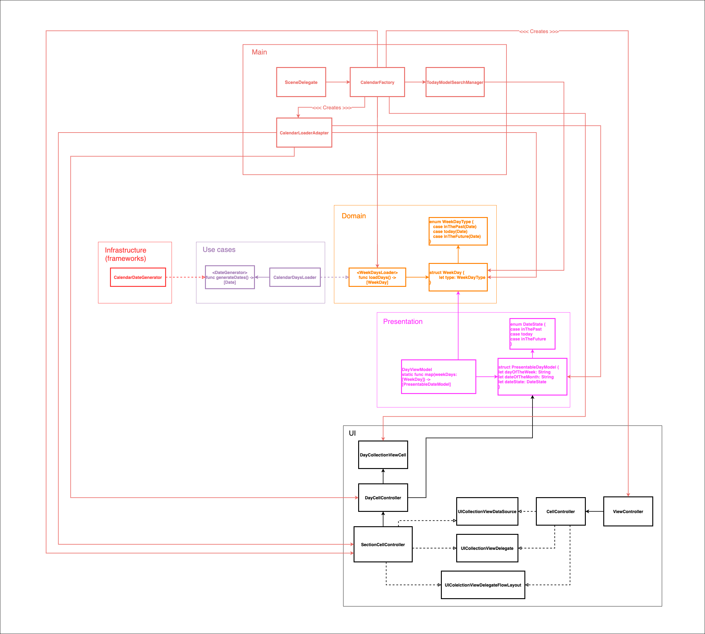

# HabitTrackerSample

## Sample feature from the app  [Habits of Health - Daily Tracker](https://apps.apple.com/us/app/habits-of-health-daily-tracker/id1477345602)

### Sample Screenshots

    
    
    

### Feature Requirements
- Fetch past week, current week and next week from the system calendar
- Indicate current day with the selected blue border on the cell
- Automatically scroll to `today` when view loads
- Respectively color the cell to indicate past days, today and future days
- Whenever cell gets selected, previous cell should be deselected
- Selected cell should stay untouched even after scrolling
- Weeks should be in the form of a page and scrolled horizontally
- `Today` cell should be indicated with blue color

## Notes for potential viewers of this repository
Project is built fully `Test-Driven with TDD` from scratch with XCTest framework. Test coverage is `95.6%`.

## Architecture and Design
- Architecture does not follow standard MVC/MVVM/MVP/VIPER or any UI-related design pattern. `Architecture is agnostic of UI` in this sample application.
- Clean Architecture guidelines are used as a reference for designing the system

Let's review the diagram for this sample app.

Diagram was built with [free diagramming tool](https://draw.io).

### Abstract Core
Core of this app is `Domain`. Domain represents all the data models and service abstractions used in the app, **no implementation**. It includes `WeekDaysLoader` for loading objects such as `WeekDay` with `WeekDayType`. WeekDayType represents whether particular `WeekDay` object is in the past, is today or is in the future. Nothing more, nothing less.

### Use Cases
Use Cases depend on core of the app and contain business logic of fetching, classifying **Date** objects into `inThePast, today, inTheFuture`. It also depends on a protocol `DateGenerator` to fetch the list of Date objects.

### Infrastructure (frameworks)
Contains framework and platform-related code (in our case Foundation and Calendar specifically). It depends on use-cases since the `dependency is inverted`. The benefit of doing so is to plug-in different framework-related class in the system without changing the rest of it.

### Presentation
Since `Date` object is meaningless for displaying on the screen, presentation layer maps `Date` objects into formatted strings with respective Locale. It contains mainly `String` properties that can be easily mapped into `label.text` in the UI. 

**P.S.** `DateState` is almost identical to `WeekDayType`, but there is a strong reason for doing so. If `PresentableDayModel` referenced `WeekDayType` directly, our UI would be dependent on core domain (which is undesirable) since we should be able to just change UI without the need to rewrite presentation logic. This might seem as duplicated to you, but it is not in fact.

### UI
 UI is developed using UIKit and `UICollectionView` was used to fulfill horizontal scrolling with paging requirement. `CalendarViewController` references a `CellController type`. This is a typealias for bunch of delegates and data sources on UICollectionView. The reason for doing so is to decouple the view controller from anything apart from UIKit. Thus, we can create other delegates and data sources and add new sections into the collection view without actually changing it. Cell registration is also done outside to prevent strong coupling between specific cells in the system.

### Main
Last piece in the chain of all modules that ties everything together is the `Main`. Main is also called as `Composition Root` which handles full DI-graph instantiation. The power of composing everything together in the centralized place helps decouple classes in different layers from each other. As you can see from the diagram, Main almost references everything in the app.

## How to run the app
- Sample project was build with Xcode `13.2.1`. You should have Xcode 13 and above to run this sample project. 
- You can run the app by simply pressing `Run` button or `⌘ + R`.
- Run tests by simply pressing `⌘ + U`.